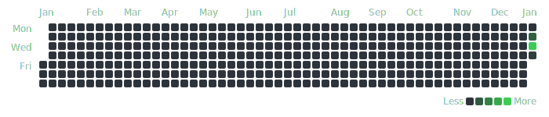

# herdstat Example

This is a sample repository demonstrating the use of the `herdstat` [GitHub action][herdstat-gha].

All the magic happens in [`.github/workflows/herdstat.yaml`](.github/workflows/herdstat.yaml) and in
[`.herdstat.yaml`](.herdstat.yaml).

## `herdstat` Contribution Graph

The generated contribution graph for the `herdstat` organization looks like this:

[herdstat-gha]: https://github.com/herdstat/herdstat-action
